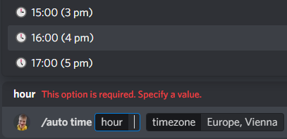

# koklesbot
## The greatest discord bot you'll ever need!

To add this bot to your server [click here!](https://discord.com/oauth2/authorize?client_id=1028334262656700506&scope=bot&permissions=1099511627775)

## Features
### Message hooks
Automated and appropriate reactions:

### Automated messages
Setup automated events to fire at a specified time:

Setup which events you want to fire:

Steam game playtime leaderboards event:

### Context menus
Interact ergonomically with context menus!

### Commands
Here are some commands!

Allow anyone to rename (almost) anyone!

Play games with your server friends!

Display game leaderboards!

Play sounds!

<!---
| Command | Description |
| --- | --- |
| `/guess` | Show informative messages |
| `/cs` | Display Counter-Strike stats |
| `/move` | Move all users to channel |
| `/radim` | Draw balls from a bag |
| `/rename` | Change a member's nickname |
--->
### Integrated APIs
* [Rest Countries](https://gitlab.com/amatos/rest-countries)
* [Steam Web API](https://steamcommunity.com/dev)

## Tech
Cloud database, docker image, app sharding.

